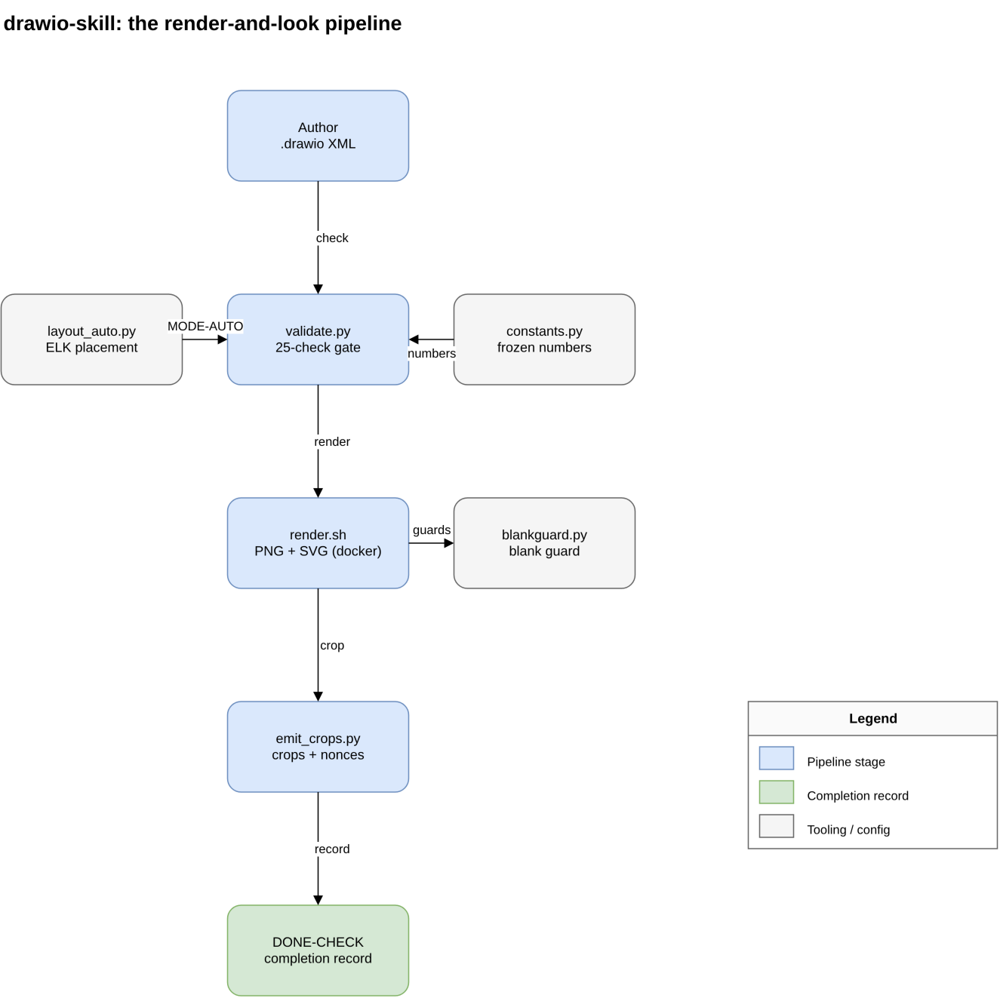

# drawio-skill

*Draw.io diagrams that survive being looked at.*

Agents hand-writing `.drawio` XML reliably ship valid files with invisible defects: overlapping
boxes, edges through nodes, labels sitting on lines, missing legends, and no rendering before
handover. This skill fixes the workflow, not just the rules. Its spine is a render-and-look loop;
the layout doctrine exists so the first render is nearly right, and no tool in the chain ever
prints a done-state.

## Architecture



The diagram above was authored, validated, rendered, and looked at with this skill's own
toolchain (source: [docs/architecture.drawio](docs/architecture.drawio)). Author `.drawio` XML,
`validate.py` gates the structure (using `constants.py`; `layout_auto.py` places 13-25 node
topologies via ELK), `render.sh` produces the PNG/SVG that `blankguard.py` checks, `emit_crops.py`
cuts the review crops, and only a fully cited DONE-CHECK closes the job.

## What it does

- **Two-mode layout.** Up to 12 nodes: deterministic grid placement by formula. 13 to 25: topology
  is delegated to the drawio layout engine (ELK) through `layout_auto.py`, with a fix ladder that
  ends in a C4 split instead of hand-nudged coordinates. Above 25: split by abstraction level.
- **A 25-check validator** (`validate.py`, Python stdlib): structural gates (ids, refs, geometry),
  geometry gates (box overlap, label collision, edge-through-node), and legend correspondence in
  both directions (every semantic fill and line style legended, no phantom entries). Hard gates
  fire only on exact geometry; anything approximated is a warning routed to visual review.
- **Headless render with a blank guard.** Pinned docker image, PNG plus SVG, hard timeout. The
  drawio CLI exit code is untrustworthy, so the guard counts drawable SVG elements instead.
- **Crop-based visual review.** `emit_crops.py` cuts zoomed crops of the highest-risk regions the
  validator found and stamps each with a nonce. The completion record must quote what was read in
  each crop, nonce included, so skipping the look is visible.
- **A completion record instead of a success message.** The validator's best verdict is
  `STRUCTURE OK - NOT YET VERIFIED`. Only a fully cited DONE-CHECK block closes the job.
- **19 regression fixtures** reproducing real observed failure modes, plus `smoke.sh` to verify
  the toolchain on a new machine, plus measured character-width calibration.

## Install

In Claude Code:

```
/plugin marketplace add phj6688/claude-marketplace
/plugin install drawio@phj
```

## Use

No slash command. The skill triggers when a session creates or edits `.drawio` files, or when a
user asks for an architecture, flowchart, ER, or network diagram as a file deliverable. The
workflow it enforces: author per the doctrine, validate, render, read the crops, hand over with
the DONE-CHECK.

## Requirements

- Docker for the render tier (`rlespinasse/drawio-desktop-headless`, pulled on first use; the
  scripts pass the required `--shm-size`). Without docker the skill degrades honestly: the
  structural validator still runs, diagrams are capped at hand-mode size, and the handover is
  labeled structure-only.
- Python 3.10+. Pillow is optional (crops fall back to coordinate listings without it).

## Layout of this repo

```
skills/drawio/
  SKILL.md              lean core: mode fork, workflow, red flags
  references/           layout, edges, legend-color, xml, verify doctrines
  scripts/              validate.py, render.sh, emit_crops.py, layout_auto.py,
                        blankguard.py, calibrate_charwidth.py, constants.py
  tests/                19 fixtures + expected verdicts + run_fixtures.py
  smoke.sh              first-use toolchain verification
```

## Acknowledgements

The doctrine synthesizes published guidance from the draw.io diagram-generation reference and
the mxGraph documentation, layout constants cross-checked against graphviz, dagre, and ELK
defaults, C4 and cloud-provider diagram style guides, and ideas surveyed across the open
ecosystem of diagram skills.
